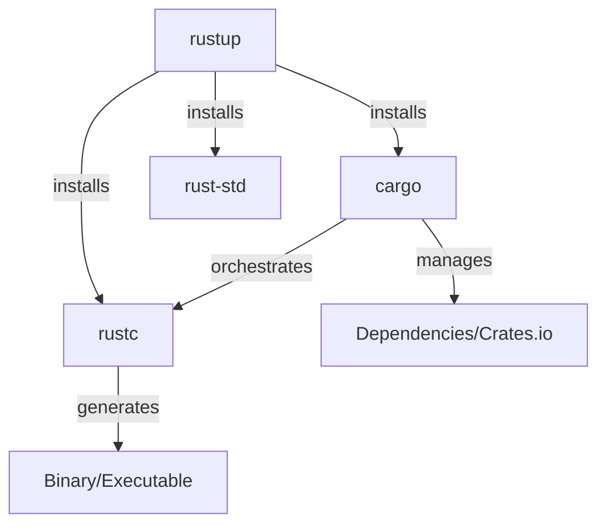
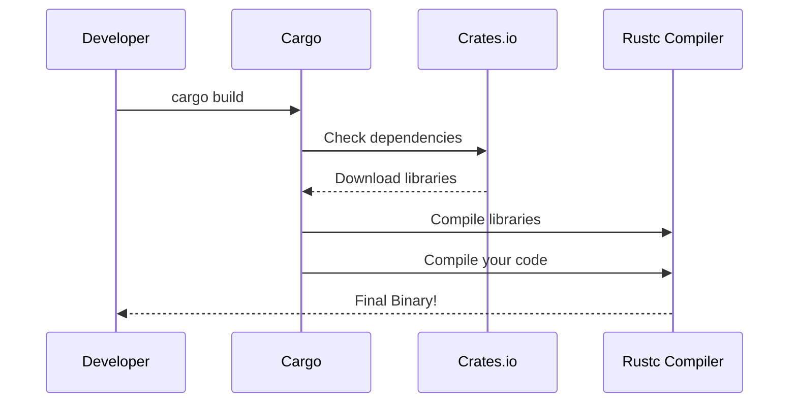

# Module 1: Cargo & The Rust Ecosystem 🦀

Welcome to your first step in the Rust journey! Before we write code, we need to understand the tools that make Rust development a "world-class" experience.

---

## 1. What is Cargo?
Think of Cargo as the **Swiss Army Knife** of Rust. In other languages, you might need separate tools for compiling, managing packages, and running tests. In Rust, Cargo does it all.

### Why do we love it?
*   **Package Manager:** It downloads and updates your libraries (called "crates").
*   **Build System:** It compiles your code.
*   **Test Runner:** It runs your unit and integration tests.
*   **Project Creator:** It sets up the standard folder structure for you.

---

## 2. The Big Three: Rust Toolchain
When you install Rust, you get three main tools. It's important to know who does what:

| Tool | Role | Analogy |
| :--- | :--- | :--- |
| **`rustup`** | The Installer/Updater | The Store (where you get the tools) |
| **`cargo`** | The Project Manager | The Foreman (manages the site and materials) |
| **`rustc`** | The Compiler | The Heavy Machinery (does the actual building) |

### Visualizing the Toolchain

> **Pro-tip:** You will almost **never** use `rustc` directly. You talk to `cargo`, and `cargo` talks to `rustc` for you.

### The Compilation Flow

---

## 3. How to Get Started (Installation)
The official way to install Rust is via **rustup**.

1.  **Visit:** [https://rustup.rs/](https://rustup.rs/)
2.  **Command:** Run the curl script (Mac/Linux) or the .exe (Windows).
3.  **Editor Setup:** 
    *   Most of us use **VS Code** with the **rust-analyzer** extension. 
    *   This gives you autocomplete, types on hover, and error highlighting.

---

## 4. Understanding the Ecosystem

### Release Channels
Rust evolves fast (new version every **6 weeks**!).
*   **Stable:** What you should use for 99% of work.
*   **Beta:** The next stable version in testing.
*   **Nightly:** Bleeding-edge features.

### Editions
Every few years (2015, 2018, 2021, 2024), Rust releases an **Edition**. 
*   **Think of it like a "Major Version Upgrade"** that is allowed to change the language slightly.
*   **The Magic:** A single project can have some parts in 2018 and others in 2021, and they will work together perfectly!

---

## 5. Summary of Cargo's Superpowers
Beyond simple building, Cargo handles:
*   **Workspaces:** Managing multiple related projects (crates) together.
*   **Crates.io:** The central hub where the community shares code.
*   **Plugins:** You can add new commands, like `cargo clippy` (to check for "smelly" code).
