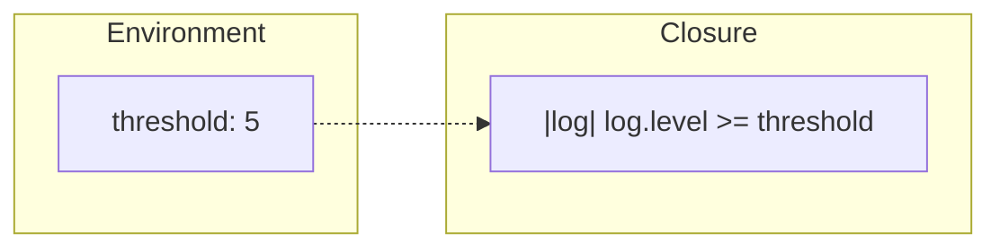

# 🦀 Training Session: Closures

**Goal:** Understand how to create anonymous functions that can capture variables from their surrounding environment.

---

## Closure Syntax
**Lightweight Anonymous Functions**

Closures are defined using vertical bars `|args|` and are often used for short, one-off logic.

```rust
fn main() {
    // Basic syntax: |args| body
    let add_one = |x: u32| x + 1;
    
    // Type inference usually works for closures:
    let double_it = |n| n * 2;

    println!("Result: {}", double_it(5)); // Output: 10
}
```

### Key Syntax Rules:
*   **Optional Braces**: If the body is a single expression, `{}` are optional.
*   **Type Inference**: You rarely need to specify types for closure arguments or return values.
*   **Coercion**: Closures that capture nothing can be treated as regular function pointers (`fn`).

---

## Capturing the Environment
**Accessing Outer Variables**

The most powerful feature of closures is their ability to "capture" variables from the scope where they are defined.

```rust
fn main() {
    let multiplier = 3;
    
    // multiplier is "captured" by reference
    let multiply = |x| x * multiplier;
    
    println!("3 * 4 = {}", multiply(4));
}
```

### Capture Modes:
1.  **By Reference (`&T`)**: Default. Most efficient.
2.  **By Mutable Reference (`&mut T`)**: If the closure modifies a captured variable.
3.  **By Move**: Use the `move` keyword to take full ownership of captured variables. Essential for multi-threading or returning closures from functions.

```rust
let name = String::from("Alice");
let say_hi = move || println!("Hi, {name}!"); // name is moved into the closure
```

---

## Closure Traits: Fn, FnMut, and FnOnce
**How closures are stored**

The compiler automatically implements one of three traits for every closure, based on how it uses captured data.

| Trait | Meaning | Use Case |
| :--- | :--- | :--- |
| **`Fn`** | Captures by reference. | Can be called multiple times, concurrently. |
| **`FnMut`** | Captures by mutable reference. | Can be called multiple times, but can modify its state. |
| **`FnOnce`** | Captures by value (consumes data). | Can only be called **once**. |

```rust
fn apply<F>(val: i32, func: F) -> i32 
where F: Fn(i32) -> i32 {
    func(val)
}
```

---

## Exercise: Log Filter
**Filtering with Closures**

**Goal:** Use a closure to filter a list of log messages based on a dynamic threshold.

```rust
struct Log {
    level: u8,
    message: String,
}

fn filter_logs(logs: Vec<Log>, threshold: u8) -> Vec<Log> {
    // Use .into_iter().filter(|log| ...) to find matches
    logs.into_iter()
        .filter(|log| log.level >= threshold)
        .collect()
}
```

### Capture Visualization:


---

## Pro-Tips for the Instructor:
*   **Lazy Execution**: Remind students that code inside a closure only runs when the closure is *called*, not when it's defined.
*   **Function vs Closure**: Explain that closures have an "unnameable" internal type, which is why we use generics like `impl Fn` to pass them around.
*   **The `move` Keyword**: Show an example of why `move` is needed when sending a closure to a new thread (to prevent dangling references).
*   **Closure Size**: Mention that closures only take up as much memory as the variables they capture.

