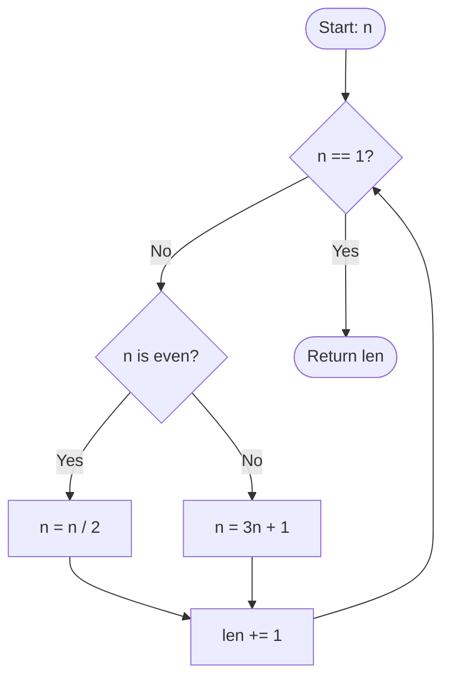

# 🦀 Training Session: Rust Control Flow Basics

**Goal:** Master how logic flows through a Rust program.

---

## Blocks and Scopes
**Everything is an Expression**

In Rust, a block `{}` is not just a group of statements—it can also be an expression that returns a value.

```rust
fn main() {
    let z = 13;
    let x = {
        let y = 10;
        z - y // No semicolon = this value is returned from the block
    };
    println!("x: {x}"); // x is 3
    // println!("{y}"); // Error! y is out of scope
}
```

### Key Rules:
*   **Implicit Return**: The last expression in a block (without a semicolon) is its return value.
*   **Scope**: Variables declared inside a block stay inside that block.
*   **Semicolons matter**: If you add a `;` to the last line, the block returns `()` (unit type).

---

## If Expressions
**The "Ternary" replacement**

Because `if` is an expression, you can use it to assign values.

```rust
fn main() {
    let x = 10;
    let size = if x < 20 { "small" } else { "large" };
    
    println!("number size: {size}");
}
```

### Safety Rules:
*   **Type Matching**: Both `if` and `else` blocks **must** return the same type.
*   **No Parens**: You don't need `()` around the condition, but `{}` are mandatory for the blocks.

---

## Match Expressions
**More than just a Switch**

`match` is powerful, concise, and safe. It forces you to handle every possible case.

```rust
fn main() {
    let val = 1;
    match val {
        1 => println!("one"),
        10 => println!("ten"),
        _ => println!("something else"), // The "default" case
    }
}
```

### Why it's better than `switch`:
*   **Exhaustiveness**: The compiler won't let you forget a case.
*   **No Fall-through**: No need for `break;` at the end of every arm.
*   **Matches as Expressions**: Like `if`, `match` can return values.

---

## Loops: while, for, and loop
**Three ways to repeat**

### 1. `while`: Conditional Loop
```rust
while x >= 10 {
    x = x / 2;
}
```

### 2. `for`: Iterator Loop (Preferred)
```rust
for x in 1..5 { // 1, 2, 3, 4
    println!("{x}");
}

for elem in [2, 4, 8] {
    println!("{elem}");
}
```

### 3. `loop`: Infinite Loop
```rust
loop {
    // Keep doing this until we hit 'break'
}
```

---

## Break and Continue
**Controlling the Loop**

*   `continue`: Skip the rest of this iteration.
*   `break`: Exit the loop entirely.

### Returning from a `loop`:
Only `loop` can return a value via `break`.
```rust
let result = loop {
    i += 1;
    if i == 10 { break i * 2; }
};
```

### Nested Loops & Labels:
Use labels to break out of specific outer loops.

```rust
'outer: for i in 0..3 {
    for j in 0..3 {
        if i + j == 4 { break 'outer; }
    }
}
```

---

## Functions
**The Logic Units**

```rust
fn gcd(a: u32, b: u32) -> u32 {
    if b > 0 { 
        gcd(b, a % b) // Implicit return
    } else { 
        a             // Implicit return
    }
}
```

### Rules of Engagement:
*   **Explicit Types**: Parameters and return types (`->`) must be declared.
*   **Implicit vs Explicit Return**: Omit the `;` for the final return, or use `return` for early exits.
*   **Unit Type**: If no return type is specified, it returns `()`.

---

## Macros
**Code that writes Code**

Macros are identified by the `!` and handle variable arguments.

| Macro | Purpose |
| :--- | :--- |
| `println!` | Prints to stdout. |
| `format!` | Creates a `String` without printing. |
| `dbg!` | Prints expression + value for debugging. |
| `todo!` | Placeholder that crashes if reached. |
| `assert!` | Checks a condition, panics if false. |

---

## Exercise: Collatz Sequence
**Applying Control Flow**

**Goal:** Calculate the length of the Collatz sequence for a given `n`.
*   If `n` is 1: stop.
*   If `n` is even: `n = n / 2`
*   If `n` is odd: `n = 3 * n + 1`

```rust
fn collatz_length(mut n: i32) -> u32 {
    let mut len = 1;
    while n > 1 {
        n = if n % 2 == 0 { n / 2 } else { 3 * n + 1 };
        len += 1;
    }
    len
}
```

### Visualization:


---

## Pro-Tips for the Instructor:
*   **The Semicolon Trap**: Show students how adding a semicolon to an `if` branch or a function's last line changes the return type to `()`.
*   **Immutability**: Remind them that arguments like `n` in the exercise must be marked `mut n` to be modified inside the function.
*   **Iterators**: Mention that `1..5` is exclusive (1-4) while `1..=5` is inclusive (1-5).

