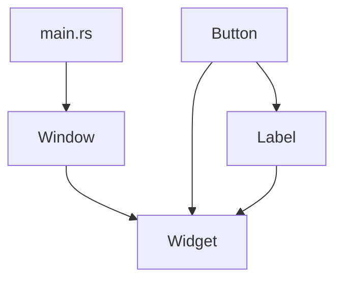

# 🦀 Training Session: Modules and Organization

**Goal:** Learn how to organize code into modules, manage visibility, and use the filesystem hierarchy for clean project structures.

---

## What is a Module?
**Namespacing for Logic**

Modules allow you to group related code (structs, enums, functions) together and control which parts are visible to the outside world.

```rust
mod auth {
    pub fn login() { /* ... */ }
    fn hash_password() { /* ... */ } // Private by default
}

fn main() {
    auth::login(); // Works
    // auth::hash_password(); // Error! Private function
}
```

---

## Filesystem Hierarchy
**Mapping code to files**

Rust looks for modules in your filesystem based on their names.

1.  **In-file**: `mod foo { ... }`
2.  **Separate file**: `mod foo;` (looks for `foo.rs` or `foo/mod.rs`)
3.  **Nested**: `mod foo { mod bar; }` (looks for `foo/bar.rs`)

### Project Structure Example:
```text
src/
├── main.rs       (Crate Root)
├── auth.rs       (mod auth)
└── auth/
    └── crypto.rs (mod crypto inside auth)
```

---

## Visibility (Privacy)
**The Boundary of Logic**

*   **Private by default**: Everything in a module is invisible to its parent unless marked `pub`.
*   **`pub`**: Visible to anyone who can see the module.
*   **`pub(crate)`**: Visible only within the current crate.
*   **`pub(super)`**: Visible only to the parent module.

### Struct Field Privacy:
Fields in a struct are also private by default!
```rust
pub struct User {
    pub name: String,
    age: u8, // Private!
}
```

---

## use, self, and super
**Bringing items into scope**

*   **`use`**: Create a shortcut to a path.
*   **`self`**: Refers to the current module.
*   **`super`**: Refers to the parent module.
*   **`crate`**: Refers to the crate root.

```rust
use std::collections::HashMap; // Absolute path
use super::helper;             // Parent module
use crate::models::User;       // From src/main.rs or src/lib.rs
```

---

## Re-exporting
**Designing a clean Public API**

You can use `pub use` to make internal modules accessible at a more convenient top-level path.

```rust
// In src/lib.rs
mod internal_implementation;
pub use internal_implementation::PublicType;
```

---

## Exercise: GUI Library Organization
**Refactoring for Scale**

**Goal:** Take a single-file GUI library and split it into a clean module hierarchy.

```text
src/
├── main.rs
├── widget.rs (trait Widget)
├── label.rs  (struct Label)
├── button.rs (struct Button)
└── window.rs (struct Window)
```

### Dependency Graph:


---

## Pro-Tips for the Instructor:
*   **Module != File**: Remind students that `mod foo;` is a *declaration* that tells Rust to go find the file. You don't "import" files like in Python; you declare a module tree.
*   **Encapsulation**: Emphasize that keeping fields private allows you to change internal implementation without breaking user code.
*   **The `mod.rs` vs `file.rs` debate**: Explain that `foo.rs` is modern and preferred, while `foo/mod.rs` is the older style (still used).
*   **Traits and Scope**: A key gotcha! You must `use` a trait to call its methods, even if you have the object itself.

