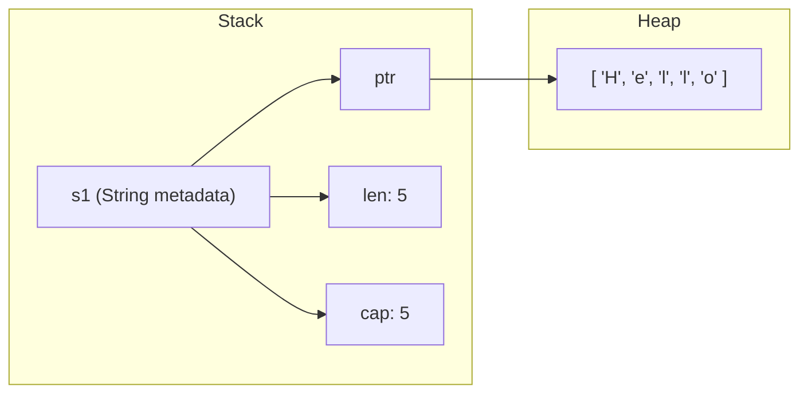

# 🦀 Training Session: Ownership and Memory Management

**Goal:** Understand how Rust achieves memory safety without a garbage collector through the concept of Ownership.

---

## Program Memory: Stack vs. Heap
**Where your data lives**

*   **Stack**: Fast, fixed-size data. Automatically cleaned up when a function returns.
*   **Heap**: Dynamically sized data (like `String` or `Vec`). Needs explicit management.



---

## The Three Rules of Ownership
**The heart of Rust's safety**

1.  Each value in Rust has a variable that’s called its **owner**.
2.  There can only be **one owner** at a time.
3.  When the owner goes out of scope, the value will be **dropped** (memory freed).

---

## Move Semantics
**Transferring Ownership**

When you assign one variable to another, the ownership is **moved**. The original variable becomes invalid.

```rust
fn main() {
    let s1 = String::from("Hello");
    let s2 = s1; // Ownership MOVES to s2
    
    // println!("{s1}"); // Error! s1 is no longer valid
    println!("{s2}");    // This works!
}
```

### Why Move?
Moving prevents "double-free" errors. Since only `s2` owns the data, only `s2` will try to free it when the scope ends.

---

## Copy vs. Clone
**Duplicating Data**

### 1. Copy Types
Small, fixed-size types stored entirely on the stack (integers, bools, chars) are **Copied** instead of Moved.

```rust
let x = 5;
let y = x; // x is still valid!
```

### 2. Clone
For heap data, you must explicitly call `.clone()` to duplicate the data.

```rust
let s1 = String::from("Hello");
let s2 = s1.clone(); // Deep copy of the heap data
// Both s1 and s2 are valid.
```

---

## The Drop Trait
**Custom Destructors**

You can run custom code when a value goes out of scope by implementing the `Drop` trait.

```rust
struct DatabaseConnection {
    url: String,
}

impl Drop for DatabaseConnection {
    fn drop(&mut self) {
        println!("Closing connection to {}", self.url);
    }
}
```

*   **Manual Drop**: You can drop a value early using `drop(var)`.

---

## Exercise: Builder Pattern
**Ownership in APIs**

**Goal:** Use ownership to create a "Builder" that consumes itself to produce a final object.

```rust
struct PackageBuilder(Package);

impl PackageBuilder {
    // Takes 'self' by value (consumes it) and returns 'Self'
    fn version(mut self, version: String) -> Self {
        self.0.version = version;
        self
    }

    // Final step: consumes the builder and returns the Package
    fn build(self) -> Package {
        self.0
    }
}
```

---

## Pro-Tips for the Instructor:
*   **Safety without Speed Loss**: Emphasize that Ownership happens at *compile time*. The resulting machine code is just as fast as C.
*   **The "Book" Analogy**: Ownership is like a physical book. If I give it to you, I don't have it anymore. If I want to keep it, I have to photocopy it (Clone).
*   **Copy Trait**: Remind students that they can add `#[derive(Copy, Clone)]` to their own simple structs, but only if all fields also implement `Copy`.
*   **Double-Free**: Explain how move semantics solve the classic C++ issue of two pointers trying to free the same heap memory.

