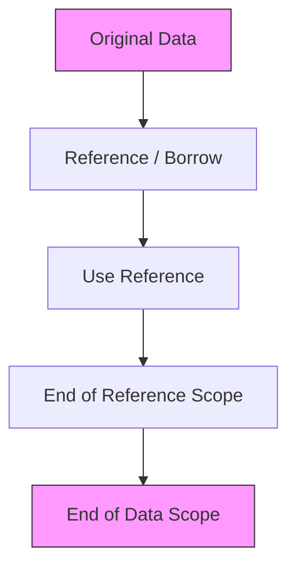

# 🦀 Training Session: References (Borrowing)

**Goal:** Understand how to access data without taking ownership, using shared and exclusive references.

---

## Shared References
**Read-Only Access**

A shared reference `&T` allows you to read a value without owning it. Multiple shared references can exist at the same time.

```rust
fn main() {
    let a = 'A';
    let b = 'B';
    let mut r: &char = &a; // r points to a
    println!("r: {r}");
    
    r = &b; // r now points to b
    println!("r: {r}");
}
```

### Key Rules:
*   **Immutable**: You cannot change the value through a shared reference, even if the original value was `mut`.
*   **Safety**: References are **never null**. Rust ensures they always point to valid memory.
*   **Auto-Dereferencing**: Rust automatically dereferences when calling methods (e.g., `r.is_ascii()` instead of `(*r).is_ascii()`).

---

## Exclusive References
**Read-Write Access**

An exclusive reference `&mut T` (also called a mutable reference) allows you to modify the value it refers to.

```rust
fn main() {
    let mut point = (1, 2);
    let x_coord = &mut point.0;
    
    *x_coord = 20; // Dereference to modify
    println!("point: {point:?}");
}
```

### The "Exclusive" Rule:
*   **Only One**: While an exclusive reference exists, **no other references** (shared or exclusive) can exist for that data.
*   **No Direct Access**: You cannot access the original variable directly while it is "borrowed" exclusively.

---

## Slices
**A View into a Collection**

Slices `&[T]` are references to a contiguous sequence of elements in a collection (like an array).

```rust
fn main() {
    let a: [i32; 6] = [10, 20, 30, 40, 50, 60];
    let s: &[i32] = &a[2..4]; // Slices elements at index 2 and 3
    
    println!("s: {s:?}"); // Output: [30, 40]
}
```

### Why use Slices?
*   **Flexible Size**: Unlike arrays, the length of a slice is determined at runtime, not part of the type.
*   **Safe**: Rust checks bounds at runtime to prevent buffer overflows.

---

## Reference Validity (Lifetimes)
**Preventing Dangling Pointers**

Rust's compiler (the "Borrow Checker") ensures that a reference never outlives the data it points to.


*If "End Data Scope" happened before "End of Reference Scope", Rust would refuse to compile.*

---

## Exercise: Geometry
**Working with References**

**Goal:** Implement a function that calculates the magnitude of a 2D vector by reference.

```rust
struct Point {
    x: f64,
    y: f64,
}

fn magnitude(p: &Point) -> f64 {
    (p.x.powi(2) + p.y.powi(2)).sqrt()
}

fn main() {
    let p = Point { x: 3.0, y: 4.0 };
    println!("Magnitude: {}", magnitude(&p));
}
```

---

## Pro-Tips for the Instructor:
*   **The "Library" Analogy**: Shared references are like books in a public library (anyone can read). Exclusive references are like a book you've checked out to edit (no one else can even look at it until you return it).
*   **Rebinding vs Mutating**: Explain that `let mut r: &char` means the *pointer* can change where it points, while `let r: &mut char` means the *value* it points to can be changed.
*   **Dereferencing**: Show the difference between `r` (the pointer) and `*r` (the value).

