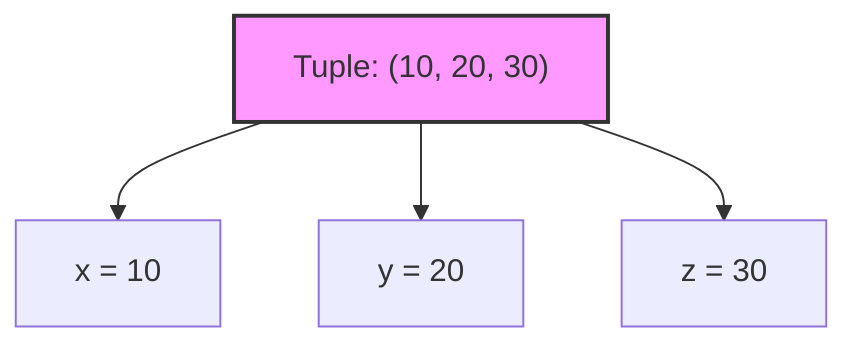
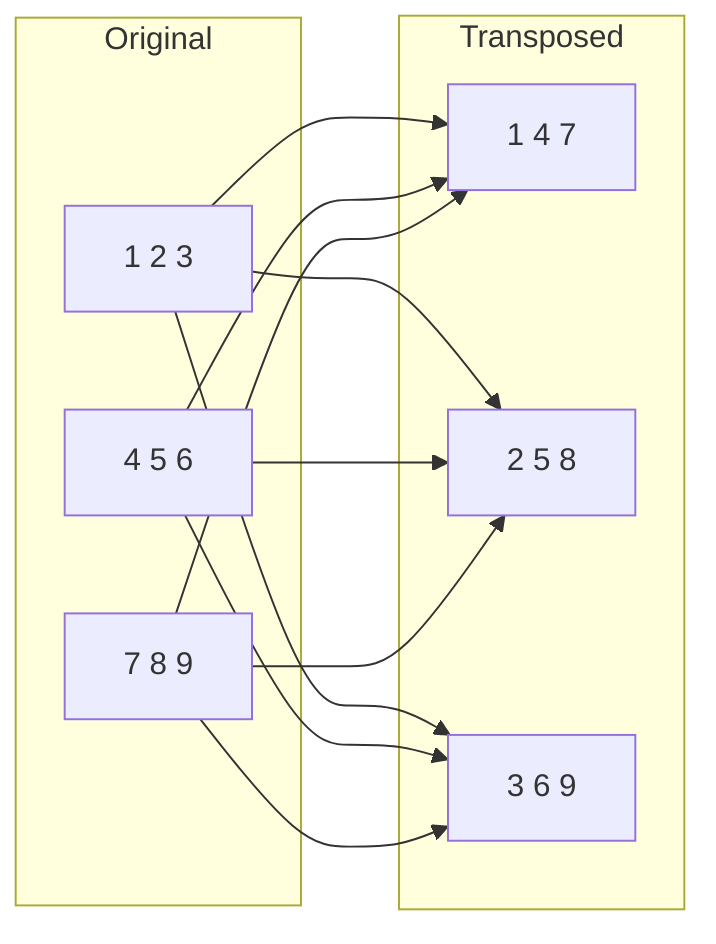

# 🦀 Training Session: Tuples and Arrays

**Goal:** Understand fixed-size composite types and how to destructure them.

---

## Arrays
**Fixed-size, same-type collections**

An array `[T; N]` holds `N` elements of type `T`. The size is fixed at compile time.

```rust
fn main() {
    let mut a: [i8; 5] = [5, 4, 3, 2, 1];
    a[2] = 0; // Access by index
    println!("a: {a:?}"); // Debug printing
}
```

### Key Characteristics:
*   **Stack Allocated**: Arrays go on the stack, not the heap.
*   **Fixed Length**: You cannot add or remove elements. The length is part of the type—`[u8; 3]` and `[u8; 4]` are different types!
*   **Shorthand Syntax**: `[0; 100]` creates an array of 100 zeros.
*   **Safety**: Out-of-bounds access causes a **panic** at runtime (or a compiler error if the index is known at compile time).

---

## Debug Printing
**Looking inside composite types**

Standard types like `i32` can be printed with `{}`. Arrays and Tuples require **Debug Formatting**.

*   `{:?}`: Standard debug output.
*   `{:#?}`: "Pretty" debug output (adds newlines and indentation).

```rust
let a = [10, 20, 30];
println!("{:?}", a);  // Output: [10, 20, 30]
println!("{:#?}", a); // Output: nicer multiline format
```

---

## Tuples
**Mixed types in one container**

Tuples group values of different types into one compound type.

```rust
fn main() {
    let t: (i8, bool) = (7, true);
    println!("First: {}, Second: {}", t.0, t.1);
}
```

### Key Characteristics:
*   **Fixed Length**: Like arrays, you cannot change the size after creation.
*   **Mixed Types**: Can hold `(i32, f64, &str)` together.
*   **Access**: Uses dot notation with an index (`t.0`, `t.1`).
*   **Unit Type**: `()` is the empty tuple, representing "nothing" or "void".

---

## Patterns and Destructuring
**Breaking down composite types**

You can use "patterns" to pull values out of tuples and arrays easily.

```rust
fn main() {
    let tuple = (10, 20, 30);
    
    // Destructuring!
    let (x, y, z) = tuple;
    
    println!("x is {x}, y is {y}, z is {z}");
}
```

### Visualization:


---

## Array Iteration
**Looping through fixed data**

Arrays can be used directly in `for` loops. (Note: Tuples cannot be iterated this way because their types vary).

```rust
fn main() {
    let primes = [2, 3, 5, 7, 11];
    for prime in primes {
        println!("{prime} is a prime number");
    }
}
```

---

## Exercise: Nested Arrays (Matrix Transpose)
**Handling data in 2D**

**Goal:** Write a function `transpose` that turns rows into columns for a 3x3 matrix.

```rust
fn transpose(matrix: [[i32; 3]; 3]) -> [[i32; 3]; 3] {
    let mut result = [[0; 3]; 3];
    for i in 0..3 {
        for j in 0..3 {
            result[j][i] = matrix[i][j];
        }
    }
    result
}
```

### Transpose Logic:

*(Visualizing the swap of indices: `[i][j]` becomes `[j][i]`)*

---

## Pro-Tips for the Instructor:
*   **The Length is the Type**: Emphasize that you can't pass a `[i32; 4]` to a function expecting `[i32; 3]`. This is a common source of confusion for beginners.
*   **Stack Allocation**: Mention that arrays are great for performance because they avoid heap allocation overhead.
*   **Tuples vs Arrays**: Use Arrays when you have many items of the **same** type. Use Tuples when you have a few items of **different** types (like returning a result and an error code).
*   **dbg! vs println!**: Remind them that `dbg!(t)` is often faster for quick checks as it shows the file and line number.

