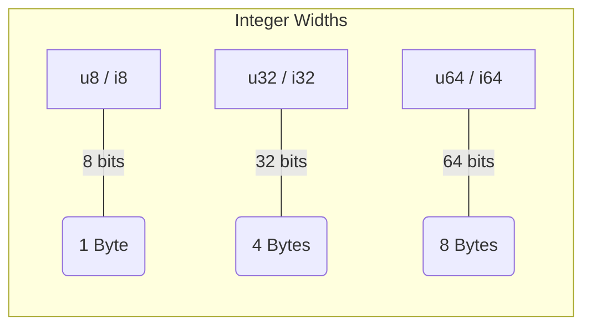
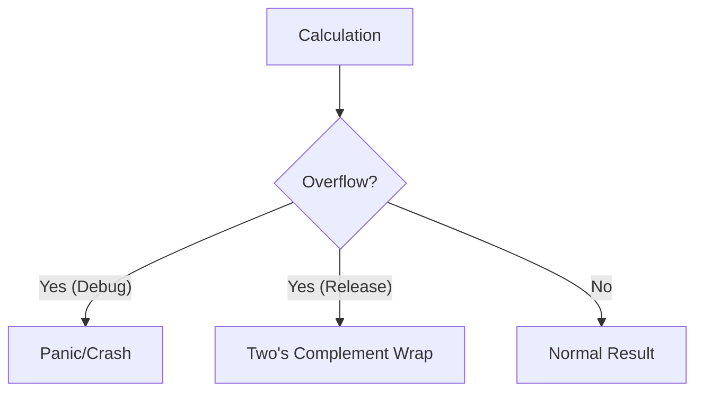
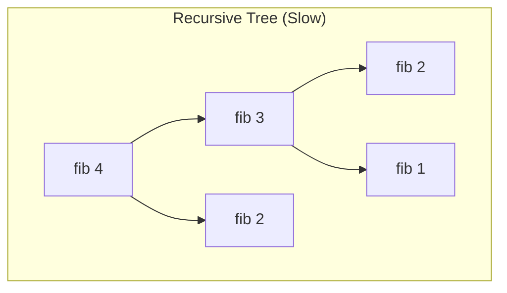

# 🦀 Training Session: Rust Types & Values

**Goal:** Understanding the building blocks of Rust.
**Duration:** 40 Minutes

---

## Slide 1: Hello World (5 min)
**The Entry Point**

```rust
fn main() {
    println!("Hello 🦀!");
}
```

### Key Takeaways for Newbies:
*   **`fn`**: Keyword to define a function.
*   **`main`**: The mandatory starting point of every Rust program.
*   **`!`**: This indicates a **Macro**, not a function. Why? Because `println!` handles a variable number of arguments (which Rust functions don't support via overloading).
*   **Unicode**: Rust strings are UTF-8 by default. Yes, you can use emojis!

---

## Slide 2: Variables & Immutability (5 min)
**Safety by Default**

In Rust, variables are **immutable** by default. You must be explicit about change.

```rust
fn main() {
    let x: i32 = 10; 
    // x = 20; <--- This would fail to compile!
    
    let mut y = 5;   // 'mut' makes it changeable
    y = 10;          // This works!
}
```

### Why this matters:
*   Prevents accidental data corruption.
*   Makes code easier to reason about (if it's not `mut`, it never changes).

---

## Slide 3: Scalar Types - Integers (5 min)
**Fixed Widths for Performance**

Rust gives you fine-grained control over memory.

| Type | Description | Width |
| :--- | :--- | :--- |
| `i8`, `i16`, `i32`, `i64`, `i128` | Signed Integers | 8 to 128 bits |
| `u8`, `u16`, `u32`, `u64`, `u128` | Unsigned Integers | 8 to 128 bits |
| `isize`, `usize` | Pointer-sized | 32 or 64 bits (arch dependent) |

### Memory Visualization:



---

## Slide 4: Scalar Types - Floats, Chars & Bools (5 min)

*   **Floating Point**: `f32` (single precision) and `f64` (double precision).
*   **Char**: `'a'`, `'α'`, `'∞'`. **Crucial:** A `char` in Rust is **4 bytes** (32 bits) because it represents a Unicode Scalar Value, not just ASCII.
*   **Bool**: `true` or `false` (1 byte).

---

## Slide 5: Arithmetic & Overflow (3 min)
**What happens when things go wrong?**

```rust
let a: i16 = 30_000;
let b: i16 = 30_000;
let c = a + b; // Overflow!
```

### Rust's Safety Shield:
1.  **Debug Mode**: The program will **panic** (crash with an error).
2.  **Release Mode**: The value will **wrap around** (standard C behavior).
3.  **Explicit Handling**: You can use methods like `.saturating_add()` or `.checked_add()`.



---

## Slide 6: Type Inference (3 min)
**The Compiler is Smart**

You don't always have to type out the types. The compiler looks at how you *use* the variable.

```rust
fn takes_u32(x: u32) { /* ... */ }

fn main() {
    let x = 10;    // Compiler thinks: "Maybe i32?"
    takes_u32(x);  // Compiler sees this: "Ah, x must be u32!"
}
```

**Defaults:**
*   Integers default to `i32`.
*   Floats default to `f64`.

---

## Slide 7: Exercise - Fibonacci (15 min)
**Putting it all together**

**Goal:** Write a function `fib(n)` that calculates the nth Fibonacci number.

### Recursive Solution (The "Simple" way):
```rust
fn fib(n: u32) -> u32 {
    if n < 2 {
        return n;
    } else {
        return fib(n - 1) + fib(n - 2);
    }
}
```

### Discussion Points:
1.  **Overflow**: Fibonacci grows fast! `u32` will panic around `n = 47`.
2.  **Performance**: Show them the difference between the recursive "tree" and a simple loop.



### Iterative Solution (The "Pro" way):
Explain that a loop is more memory efficient because it doesn't grow the stack.

---

## Pro-Tips for the Instructor:
*   **Uncommenting code**: During Slide 2, show them the compiler error when trying to mutate an immutable variable. Rust errors are "teachers," not just "warnings."
*   **Underscores**: Mention that `1_000_000` is valid syntax for readability.
*   **The `{integer}` error**: Explain that if they see `{integer}` in an error message, it means the compiler knows it's a number but hasn't decided which size yet.

